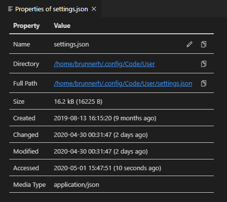

# File Properties Viewer

This is an extension for [Visual Studio Code](https://code.visualstudio.com/) which adds a view, command and related context menu entries for displaying file system properties of a given file. It shows file size and timestamps like the creation date.

## Features

### View

The view can by default be found in the "Explorer" section of the side bar. It can be dragged to its own section, the bottom panel or the side panel. This view updates as the opened file changes.

### Command

The command can be invoked via command palette, keyboard shortcut or from either the tab context menu, or the project explorer file context menu.

A similar view will be opened for the respective file. This view is always associated with a specific file:

### Media Information

The [`Media Type`](https://en.wikipedia.org/wiki/Media_type) is determined based on the file name only. Results may be inaccurate if the same file extension is used by multiple file types. Uncommon types may also not be recognized.

Additional information can be provided by the following applications:

- [`mediainfo`](https://mediaarea.net/en/MediaInfo) - Queries media information of images, audio and video.

If the applications are available in the `PATH`, they will be called unless they are explicitly disabled via the settings. See the [installation on Windows section](#installing-utility-applications-on-windows) for some help with setting that up.

## Extension Settings

This extension has the following settings (`filePropertiesViewer.<setting>`):

- `sizeMode`: Whether to show file sizes in kibi (factor 1024) or kilo (factor 1000).
- `dateTimeFormat`: Sets a custom date/time format for the timestamps.
- `disableRelativeTimestamps`: Turns off relative timestamp display. 
- `showHeader`: Controls whether the table header row is shown.
- `queryMediaInfo`: Whether media information via mediainfo should be requested.
- `propertyRows`: Configures which top-level property rows are shown and in which order.
- `outputStylePath`: Sets a path to a CSS file used for styling the output table.  
  The default style can be found [here](./styles/default.css).  
  The following classes are used within the table:
  - `icon-button`: Used on the edit and copy buttons. Has an `svg` as immediate child.
  - `column-header-row`: The very top row.
    - `column-header-cell`: Cells in top row.
  - `property-row`: Row with property and value.
    - `key-cell`: Cell in property column.
    - `value-cell`: Cell of value column.
    - `indent-<n>`: Defined on property cell, number `<n>` increases for nested property rows.
  - `group-row`: Top level group row (e.g. `Media Info`).
    - `group-cell`: Cell of group row (spans both columns).
  - `sub-group-row`: Second level group row (e.g. `Media Info` > `Image`)
    - `sub-group-cell`: Cell of sub-group row (spans both columns).

  The root element has a `data-view` attribute whose value will be either `static` or `command` depending on how the view was displayed.

## Installing Utility Applications on Windows

### MediaInfo

1. Download the **CLI** for the respective architecture from the [Windows download section](https://mediaarea.net/en/MediaInfo/Download/Windows): 
   
2. Extract the archive to a directory and copy its location from the address bar of the explorer. The directory should contain the `MediaInfo.exe` application: 
   
3. Add the copied location to the `PATH` environment variable. (See [respective subsection](#adding-directories-to-the-path-environment-variable).)

### Adding directories to the `PATH` environment variable

The `PATH` variable is used by the operating system to resolve names of executables if no absolute or relative path is provided. It is a semi-colon separated list of directories in which the operating system will look for applications.

Depending on the version of Windows this process can differ. Search online if this outline is not helpful to you; there exist guides for all versions (and other languages).

1. Search for "environment variables" from the start menu. There should be an option to change those for the current user. 
   
2. In the list of variables for your user find the one called `Path` (casing does not matter). Create it if it does not exist, click "Edit" otherwise. 
   
3. Click the "New" button to add a new directory path to the variable. Paste or type the directory location you want to add. 
   
4. "OK" all the dialogs.
5. Restart VS Code to have it load the updated variable.
